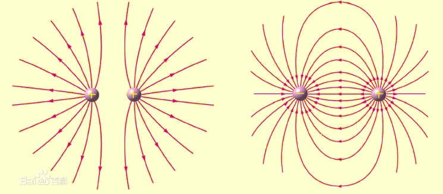

# 静电场的描述

本章，我们要知道和理解**静电下有哪些现象**，**这些现象是怎么产生的**，以及如何从**多个方面来定义和描述**静电场。

## 静电现象

静电生活中是非常常见的，例如：

- 梳头时，头发“飘”起来
- 黑暗中，听到噼啪的声响
- 见面握手，感受到刺痛的“触电”

  

### 起电方式

起电就是**使物体带电**，并不是创造了电荷，而是引起了**负电荷**的转移，使物体显电性。

!!! Tip
    只有负电荷会移动，正电荷是始终保持不动、也不转移的。

常见的**摩擦起电**方式有：

- **丝绸** 摩擦 **玻璃棒** ← 带**正**电
- **毛皮** 摩擦 **橡胶棒** ← 带**负**电

除此之外还有**接触起电**和**感应起电**，一共三种起电方法。

同种电荷相互排斥，异种电荷相互吸引。由于受附近**带电体影响**而引起**导体**中正负电荷**重新分布**的现象叫**静电效应**。

### 描述电荷数量的多少 —— *电荷量* {#dianliang}

电荷量，简称 **“电量”** 。

**符号**：$e$

**单位**：库仑 $C$

**种类**：只有两种

- 正电荷 $+$
- 负电荷 $-$

!!! Tip "异种电荷相互接触"
    异种电荷接触时，电荷会同时中和和平分。

###  元电荷

**一个电子**所带的电量的**绝对值**叫作**元电荷**，因为电子所带的电荷量最小。

密立根通过**油滴实验**测定了元电荷，元电荷是只是一个**值**，不是电子或者任何实在的东西。

- 精确值：

$$
    e = 1.602176462(83) * 10^{-19} C
$$

- 粗略值：

$$
    e = 1.60 * 10^{-19} C
$$

!!! Note "电荷与质量的比"
    测定电荷与质量的比是研究带电粒子和物质结构的重要方法，荷质比现在也叫**比荷**。

    1897年J.J.汤姆孙通过电磁偏转的方法测量了阴极射线粒子的荷质比，它比电解中的单价氢离子的荷质比约大2000倍，从而发现了比氢原子更小的组成原子的物质单元，定名为电子。

    电子的比荷，即 $e \over m_e$.

    $$
        {e \over m_e} = 1.76 * 10^{11} C / kg
    $$

### 电荷守恒定律

尽管物体的带电过程实际上就是得失电子的过程，但**在任意空间区域内电荷量的变化，始终等于流入这区域的电荷量减去流出这区域的电荷量**。

!!! Note "绝对定律与近似定律"
    电荷守恒定律是自然界中最基本的守恒定律之一，是 **“绝对定律”** （exact law），因为其从来没有被打破过。

    质能守恒定律、动量守恒定律、角动量守恒定律也是绝对定律。

    质量守恒定律、能量守恒定律是 **近似定律** ，它们只是近似于正确的，有些情况下并不适用。

### 静电现象的解释

静电现象可以分为两种：

- **摩擦起电**：*通过摩擦使物体带电*

    —— 电子**获得能量挣脱原子的*束缚***而从一个物体转移到另一个物体。

- **静电感应**：*当带电体靠近导体时，导体内的自由电子向靠近或远离带电体的地方移动*

    —— 带电体在**电荷的作用**下，导体上的正负电荷重新分布，从而使电荷从导体的一部分转移到另一部分。

## 描述静电力的大小

库仑定律是关于**真空中**两个**静止**的**点电荷**之间相互作用力的规律。

库仑力是在以上**特定情况**下的静电力。

### 概念 —— *点电荷*

点电荷是本身的线度比相互之间的距离**小得多**的带电体，也就是说此时带电体的大小和形状可以**忽略不计**。

点电荷是理想的物理模型，实际上是**不存在**的。

### 影响静电力的因素

**静电力的大小**只受两个因素影响：

电荷之间的**距离**：后者不变时，**距离越短静电力越大**，反之亦然。

电荷各自的**电量**：前者不变时，**电量越大静电力越大**，反之亦然。

### 库仑定律的内容 {#kulunli}

因为静电力只受**距离**和**电量**的影响，而且：

- 静电力同它们的电荷量的乘积成正比
- 静电力同它们之间的距离的二次方成反比

故可以推出**公式**：

$$
    F = k \frac {{q_1}{q_2}} {r^2}
$$

其中：

- $F$ 是 **库仑力**：$F = ? N$
- $r$ 是 **点电荷之间的距离**：$r = ? m$
- $q_1$ 与 $q_2$ 是**点电荷的电量**：$e = ? C$
- $k$ 是 **库仑常数**： $k = 9.0 * 10^9 N m^2 / c²$ .

!!! Success "以下是正确的"
    - 库仑力的大小和电性没有关系

!!! Failure "以下是错误的"
    - 两球之间的库仑力，其 $r$ 一定是两球之间的距离。

    - 对于库仑力公式 $F = k \frac {{q_1}{q_2}} {r^2}$ ，当 $r \rightarrow \infty$ 时，$F \rightarrow 0$ ；当$F \rightarrow 0$ 时，$r \rightarrow \infty$ . 

    —— 库仑定律必须满足条件才成立，而两球不一定是点电荷，距离也不能趋于无限小。

## 电场

电场是电荷及变化磁场周围空间里存在的一种特殊物质。这种物质与通常的实物不同，它虽然不是由分子原子所组成的，但它却是客观存在的特殊物质，具有通常物质所具有的力和能量等客观属性。

!!! Note "场"
    **场**是指某种空间区域，其中具有一定性质的物体能对**与之不相接触**的类似物体施加**一种力**。

### 概念 —— *电场*

- 产生电场的电荷叫**场源电荷**。
- 本章只探究静止的场源电荷在其周围产生的电场，即**静电场**。

### 从力的角度描述电场 —— *电场强度*

电场强度，简称 **“场强”** ，它只反映**电场自身**的某种性质。

电场强度是试探电荷受到的[**静电力**](#kulunli)与试探电荷的[**电量**](#dianliang)之比。

**符号**：$E$（electric field intensity）

**单位**：牛顿每[库仑](#dianliang) $N / C$

**方向**：与该点所受的静电力的方向相同或相反。

!!! Tip 
    场强有方向，场强是矢量。

**公式**：

$$
    E = \frac F q
$$

其中：

- $F$ 是 试探电荷受到的静电力
- $q$ 是 试探电荷自身的电荷量

!!! Tip
    场强是可以叠加的，叠加以后的场强是原来各个点电荷单独存在时在该点产生的场强的矢量和。

!!! Note "匀强电场"
    匀强电场是一种特殊的电场，各处场强**大小相等**，**方向相同**。

    两块相同、正对放置的平行金属板，若板间距离很小，当它们分别带有等量的正负电荷时，板间的电场就是匀强电场。

### 图形化描述场强 —— *电场线* {#dianchangxian}

电场线是方便了解电场的工具。

电场线是带箭头的线，电场线从电势高的地方指向电势低的地方。

同一幅图中，电场线越密，电场越强。

  

!!! Warning "电场线的特性"
    电场线有许多**特性**，例如：

    - **任意**两条电场线不相交
    - 电场线上每一点的切线方向都与该点的处的场强方向相同
    - 电场线**不一定是闭合的**，这与地理中的等高线不同
    - 匀强电场中的电场线是间隔距离相等的**平行直线**

## 电势

### 电场力做功 —— *匀强电场*

**公式**：

$$
    W = E q l cos \theta
$$

其中：

- $q$ 是 做功的电荷自身的**电量**
- $E$ 是 **场强**，匀强电场中场强处处相等
- $l$ 是 **路径**，即终点和起点之间的连线
- $\theta$ 是 电场力与位移方向上的**夹角**

!!! Note "推导过程"
    先回忆功的求法：

    $$
        W = F s
    $$

    观察公式，可以发现 $s$ 易得，因此只需要得到 $F$ 的求法即可。
    
    回忆并转化电场相关公式得：

    $$
        {E = \frac F q} \to {F = E q}
    $$

    即：

    $$
        F = E q ，s = l * cos \theta
    $$

    最终就可以得到：

    $$
        W = E q l cos \theta
    $$

### 电势能

!!! Tip
    联系之前学过的重力势能、弹力势能等势能来理解。

!!! Tip
    能无方向，能是矢量。

电势能是处于电场的**电荷所具有的势能**，并不直接反应电场的性质。

电势能是**相对**而言的，就像重力势能是相对于选取的高度一样。

一般选取**一个无限远的点**作为零势能点。

!!! Note "功与能的关系"
    电荷在静电场做的功 等于 电荷的电势能的减少量。

    作功可以使物体具有的能量发生变化。功是过程量，物体能量变化大小是用做功的多少来度量的，但功和能不能相互转化。

### 从能量的角度描述电场 —— *电势*

电势是点电荷的**电势能**跟它所带的**电荷量**之比。

**符号**：$\varphi$

**单位**：伏特 $V$

**公式**：

$$
    \varphi = \frac {E_p} q
$$

其中：

- $E$ 是 该点处的电势能
- $p$ 指的是 potential ，即电势
- $q$ 是 该点处的电量

### 图形化描述电势 —— *等势面*

等势面是静电场中**电势相等**的各点构成的**面** 。

  

!!! Warning "等势面的特性"
    等势面有许多**特性**，例如：

    - 在同一等势面上移动电荷时**电场力不做功**
    - [**电场线**](#dianchangxian)总是由电势**高**的等势面**指向**电势**低**的等势面
    - 等势面一定**与电场强度垂直**，也就是与电场线垂直

!!! Tip
    等势面与电场线相互垂直

### 电势差

电势差是指两点间电势能的差值，与一般的差值不同，电势差可以是正的或者负的。

电势差用 $U_{AB}$ 来表示，以此为例，即A点的电势减去B点的电势的值。其中，AB的排列顺序决定了谁是被减数或减数。

!!! Example "反之亦然"
    $$
        U_{BA} = U_B - U_A
    $$
