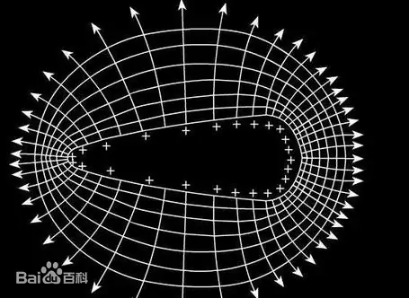

---
tags:
    - 静电
    - 电势
    - 功能
    - 等势面
    - 电势差
    - 匀强电场
---

# 电势

## 电场力做功 —— *匀强电场*

**公式**：

$$
    W = E q l cos \theta
$$

其中：

- $q$ 是 做功的电荷自身的**电量**
- $E$ 是 **场强**，匀强电场中场强处处相等
- $l$ 是 **路径**，即终点和起点之间的连线
- $\theta$ 是 电场力与位移方向上的**夹角**

!!! Note "推导过程"
    先回忆功的求法：

    $$
        W = F s
    $$

    观察公式，可以发现 $s$ 易得，因此只需要得到 $F$ 的求法即可。
    
    回忆并转化电场相关公式得：

    $$
        {E = \frac F q} \to {F = E q}
    $$

    即：

    $$
        F = E q ，s = l cos \theta
    $$

    最终就可以得到：

    $$
        W = E q l cos \theta
    $$

## 电势能

!!! Tip
    联系之前学过的重力势能、弹力势能等势能来理解。

!!! Tip
    能无方向，能是矢量。

电势能是处于电场的**电荷所具有的势能**，并不直接反应电场的性质。

电势能是**相对**而言的，就像重力势能是相对于选取的高度一样。

一般选取**一个无限远的点**作为零势能点。

!!! Note "功与能的关系"
    电荷在静电场做的功 等于 电荷的电势能的减少量。

    作功可以使物体具有的能量发生变化。功是过程量，物体能量变化大小是用做功的多少来度量的，但功和能不能相互转化。

## 从能量的角度描述电场 —— *电势*

电势是点电荷的**电势能**跟它所带的**电荷量**之比。

**符号**：$\varphi$

**单位**：伏特 $V$

**公式**：

$$
    \varphi = \frac {E_p} q
$$

其中：

- $E$ 是 该点处的电势能
- $_p$ 指的是 potential ，即电势
- $q$ 是 该点处的电量

## 图形化描述电势 —— *等势面*

等势面是静电场中**电势相等**的各点构成的**面** 。

  

!!! Warning "等势面的特性"
    等势面有许多**特性**，例如：

    - 在同一等势面上移动电荷时**电场力不做功**
    - [**电场线**](#dianchangxian)总是由电势**高**的等势面**指向**电势**低**的等势面
    - 等势面一定**与电场强度垂直**，也就是与电场线垂直

!!! Tip
    等势面与电场线相互垂直

## 电势差

电势差是指两点间**电势**的差值，与一般的差值不同，电势差可以是正的或者负的。

电势差用 $U_{AB}$ 来表示，以此为例，即A点的电势减去B点的电势的值。

!!! Example
    $$
        U_{AB} = \varphi_A - \varphi_B ，U_{BA} = \varphi_B - \varphi_A
    $$

电场力做功与电势能的关系：

$$
    W_{AB} = q U_{AB}
$$

进一步转化即得电势差的**定义式**：

$$
    U_{AB} = \frac {W_{AB}} q
$$

!!! Tip
    电场力做功等于末动能减初动能

    $$
        W_{AB} = E_{pA} - E_{pB} = q \varphi_A - q \varphi_B = q (\varphi_A - \varphi_B) = q U_{AB}
    $$

因为 $W = Fd = qEd$ ，得：

$$
    U = Ed
$$

又因为，研究表明在匀强电场中任意两个点之间的电势差等于电场与这两个点沿电场方向的距离的乘积 ，变换得：

$$
    E = \frac U d
$$
