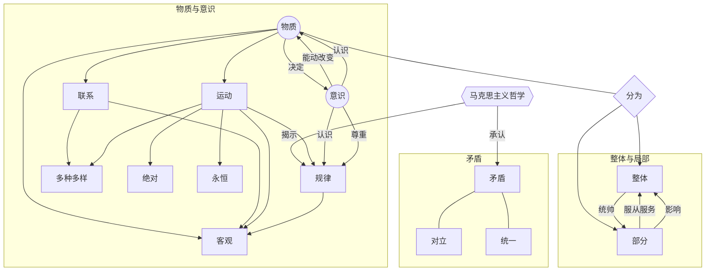

---
tags:
  - 政治
  - 哲学
  - 唯心主义
  - 唯物主义
  - 世界观
  - 方法论
  - 马克思主义
---

# 探索世界与把握规律

哲学本单元，我们要理解**什么是哲学**，什么样的哲学是**真正的哲学**，什么样的哲学是**科学的哲学**；哲学**对于我们的意义**是什么；以及什么是**马克思主义哲学的基本思想**。

***

## 时代精神的精华

### 追求智慧的学问

“哲”，即智慧。哲学是**智慧**之学和**追求智慧**之学。

#### 哲学的起源

人们在**生活实践**中对宇宙和人生的**追问**和**思考**。

#### 哲学的影响

**直接或间接地**影响着我们的学习工作生活。

#### 哲学与世界观

哲学是**系统化**和**理论化**的世界观。

#### 哲学与方法论

**有什么样的世界观就有什么样的方法论。** 方法论指导人去认识和改造世界。

#### 哲学与具体科学

哲学对**具体科学**进行概括和升华。抽象出最一般的本质和最一般的规律。

哲学为具体科学提供**世界观**和**方法论**的指导。

### 哲学的基本问题

**思维**与**存在**（意识与物质）：

- 何者是本源？（谁决定谁？）
- 二者有没有同一性？（意识能否正确认识存在？）

#### 唯物主义的形态

- 古代朴素唯物主义（物质混同于物质的具体形态）

- 近代形而上学唯物主义（物质结构混同于物质概念）

- **辩证唯物主义与历史唯物主义**（**科学的**马克思主义哲学）

#### 唯心主义的形态

- 主观唯心主义（世界依赖与人的精神）

- 客观唯心主义（世界依赖于客观精神，如神、理念）

### 马克思主义哲学

马克思主义哲学的独特理论品质是**与时俱进**。

#### 人民性

站在人民立场，目标实现人类解放。

#### 科学性 革命性

揭示了世界的本质与运行规律。

#### 马克思主义的中国化

毛思想 - 邓理论 - 三代表 - 科发展 - 习思想

!!! Note
    习近平新时代中国特色社会主义思想是当代中国马克思主义、二十一世纪马克思主义，是中华文化和中国精神的时代精华，实现了马克思主义中国化的新飞跃。

## 探究世界的本质

### 世界是物质的

世界是物质的世界，世界的真正统一性在于他的物质性。

#### 自然界是物质的

物质具有：

- 先在性
- 客观实在性 ← **唯一特性**

#### 人类社会是物质的

人类是从古猿**发展**来的，人类社会和人都是不断**发展**的。

人类社会本质是客观的物质体系。

#### 物质产生意识

- **意识是人脑对客观存在主观反映。** 只有人有意识，动物或人工智能没有意识。
- **意识仅仅是物质的派生物。** 物质的长期发展产生了意识，原本没有意识。
- **物质决定了意识，** 意识不能决定物质。

### 运动都是有规律的

哲学上的运动是指宇宙间一切事物、现象的**变化**和**过程**。

**根本不存在**脱离运动的物质。

#### 规律是客观的

规律是客观的、不以人的意志为转移的。

规律不能**被消灭**，也不能**被创造**。

#### 正确地发挥主观能动性

- 世界可以被人能动地认识，**只有尚未认识之物，没有不可认识之物。**
- 世界可以被人能动地改造，意识指导人的改造。

意识的能动作用是巨大的，但不是无条件的。**前提是要尊重客观规律。**

!!! Note
    必须坚持从实际出发，实事求是。我们做事情要尊重物质运动的客观规律，从客观存在的事物出发，经过调查研究，找出事物本身固有的而不是臆造的规律性，作为我们行动的依据。

反对：

- 唯意志主义
- 片面强调客观条件，安于现状、因循守旧、无所作为的思想

### 把握世界的规律

既然我们已经知道了运动是有规律的，那么这些规律是什么，又该如何把握规律呢？

#### 世界是普遍联系的

关于**联系**，有一下几个基本事实：

- **任何事物都与周围其它事物有这这样或那样的联系，没有一个事物是孤立存在的**
- **联系是客观的，是事物本身所共有的，不为人的意志为转移**
- **联系是多种多样的，例如**：直接与间接，内部与外部，本质与非本质，必然与偶然

善于分析和把握事物存在和发展的各种条件，才能正确的认识和改造世界。

#### 用联系的观点看问题

用联系的观点看问题，关键是要正确认识和处理整体和部分的辩证关系，掌握系统优化的方法。

- **整体和部分是相互区别的**

整体居于主导地位，整体统帅着部分。

部分处于被支配地位，服从和服务于整体。

- **整体和部分是相互联系、密不可分的**

整体离开了部分就不存在，部分的变化影响了整体的功能。

有整体才有所谓的部分。

!!! Note "系统与要素"
    系统是相互联系和相互作用的诸要素构成的统一整体。

    系统的特征是整体性、有序性以及其优化方向是对于自生内部结构的

我们要用全局的、综合的思维方式来认识事物，掌握优化系统的方法。
    
#### 世界是永恒发展的

**世界处于永恒运动、变化、发展的过程中，例如**：

- 低级→高级 简单→复杂 资本主义→共产主义

**新事物必然战胜就事物**

- 新事物：符合客观规律、具有强大的生命力和远大的发展前途

- 旧事物：违背事物发展的必然趋势，必然灭亡

#### 用发展的观点看问题

量变：数量的增减，场所的变更

质变：根本性质的变化

### 唯物辩证法的实质与核心

#### 事物发展的源泉的动力 —— 矛盾

世界上的一切事物都包含着既对立又统一的两个方面，也就是矛盾。

矛盾就是对立与统一。其中，对立是斗争性，统一是同一性。

!!! Example
    道家学说的代表老子说：有无相生，难易相成，长短相形，高下相倾，应声相和，前后相随。

**同一性**：

- 都处在一个统一体中：相互依赖，互为前提
- 都可以在一定条件下相互转化：相互渗透，相互包含

**斗争性**：

- 都有相互分离的倾向和趋势：相互排斥，相互对立

同一性是相对的，斗争性是绝对的。没有斗争性就没有同一性。

