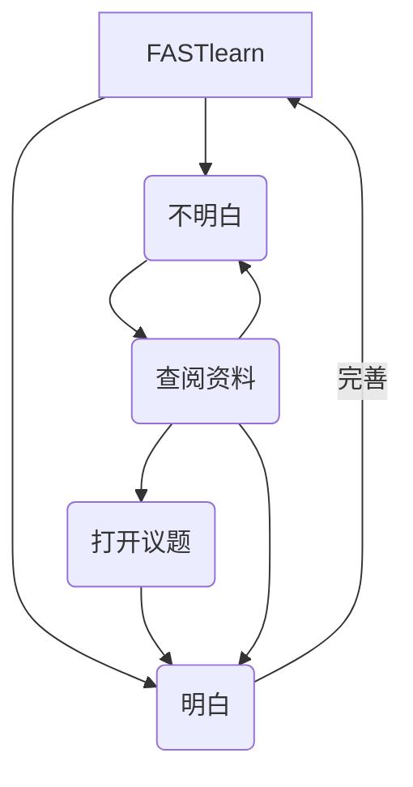

---
hide:
  - navigation
  - toc
---

# 我能吞下玻璃而不伤身体

1.  **Sanskrit**: काचं शक्नोम्यत्तुम् । नोपहिनस्ति माम् ॥
2.  **Sanskrit** _(standard transcription):_ kācaṃ śaknomyattum; nopahinasti mām.
3.  **Classical Greek**: ὕαλον ϕαγεῖν δύναμαι· τοῦτο οὔ με βλάπτει.
4.  **Greek** (monotonic): Μπορώ να φάω σπασμένα γυαλιά χωρίς να πάθω τίποτα.
5.  **Greek** (polytonic): Μπορῶ νὰ φάω σπασμένα γυαλιὰ χωρὶς νὰ πάθω τίποτα.  
    **Etruscan**: (NEEDED)
6.  **Latin**: Vitrum edere possum; mihi non nocet.
7.  **Old French**: Je puis mangier del voirre. Ne me nuit.
8.  **French**: Je peux manger du verre, ça ne me fait pas mal.
9.  **Provençal / Occitan**: Pòdi manjar de veire, me nafrariá pas.
10.  **Québécois**: J'peux manger d'la vitre, ça m'fa pas mal.
11.  **Walloon**: Dji pou magnî do vêre, çoula m' freut nén må.  
    **Champenois**: (NEEDED)  
    **Lorrain**: (NEEDED)
12.  **Picard**: Ch'peux mingi du verre, cha m'foé mie n'ma.  
    **Corsican/Corsu**: (NEEDED)  
    **Jèrriais**: (NEEDED)
13.  **Kreyòl Ayisyen** (Haitï): Mwen kap manje vè, li pa blese'm.
14.  **Basque**: Kristala jan dezaket, ez dit minik ematen.
15.  **Catalan / Català**: Puc menjar vidre, que no em fa mal.
16.  **Spanish**: Puedo comer vidrio, no me hace daño.
17.  **Aragonés**: Puedo minchar beire, no me'n fa mal .  
    **Aranés**: (NEEDED)  
    **Mallorquín**: (NEEDED)
18.  **Galician**: Eu podo xantar cristais e non cortarme.
19.  **European Portuguese**: Posso comer vidro, não me faz mal.
20.  **Brazilian Portuguese** : Posso comer vidro, não me machuca.
21.  **Caboverdiano/Kabuverdianu** (Cape Verde): M' podê cumê vidru, ca ta maguâ-m'.
22.  **Papiamentu**: Ami por kome glas anto e no ta hasimi daño.
23.  **Italian**: Posso mangiare il vetro e non mi fa male.
24.  **Milanese**: Sôn bôn de magnà el véder, el me fa minga mal.
25.  **Roman**: Me posso magna' er vetro, e nun me fa male.
26.  **Napoletano**: M' pozz magna' o'vetr, e nun m' fa mal.
27.  **Venetian**: Mi posso magnare el vetro, no'l me fa mae.
28.  **Zeneise** _(Genovese):_ Pòsso mangiâ o veddro e o no me fà mâ.
29.  **Sicilian**: Puotsu mangiari u vitru, nun mi fa mali.  
    **Campinadese** (Sardinia): (NEEDED)  
    **Lugudorese** (Sardinia): (NEEDED)
30.  **Romansch (Grischun)**: Jau sai mangiar vaider, senza che quai fa donn a mai.  
    **Romany / Tsigane**: (NEEDED)
31.  **Romanian**: Pot să mănânc sticlă și ea nu mă rănește.
32.  **Esperanto**: Mi povas manĝi vitron, ĝi ne damaĝas min.  
    **Pictish**: (NEEDED)  
    **Breton**: (NEEDED)
33.  **Cornish**: Mý a yl dybry gwéder hag éf ny wra ow ankenya.
34.  **Welsh**: Dw i'n gallu bwyta gwydr, 'dyw e ddim yn gwneud dolur i mi.
35.  **Manx Gaelic**: Foddym gee glonney agh cha jean eh gortaghey mee.
36.  **Old Irish** _(Ogham):_ ᚛᚛ᚉᚑᚅᚔᚉᚉᚔᚋ ᚔᚈᚔ ᚍᚂᚐᚅᚑ ᚅᚔᚋᚌᚓᚅᚐ᚜
37.  **Old Irish** _(Latin):_ Con·iccim ithi nglano. Ním·géna.
38.  **Irish**: Is féidir liom gloinne a ithe. Ní dhéanann sí dochar ar bith dom.
39.  **Ulster Gaelic**: Ithim-sa gloine agus ní miste damh é.
40.  **Scottish Gaelic**: S urrainn dhomh gloinne ithe; cha ghoirtich i mi.
41.  **Anglo-Saxon** _(Runes):_ ᛁᚳ᛫ᛗᚨᚷ᛫ᚷᛚᚨᛋ᛫ᛖᚩᛏᚪᚾ᛫ᚩᚾᛞ᛫ᚻᛁᛏ᛫ᚾᛖ᛫ᚻᛖᚪᚱᛗᛁᚪᚧ᛫ᛗᛖ᛬
42.  **Anglo-Saxon** _(Latin):_ Ic mæg glæs eotan ond hit ne hearmiað me.
43.  **Middle English**: Ich canne glas eten and hit hirtiþ me nouȝt.
44.  **English**: I can eat glass and it doesn't hurt me.
45.  **English** _(IPA):_ \[aɪ kæn iːt glɑːs ænd ɪt dɐz nɒt hɜːt miː\] (Received Pronunciation)
46.  **English** _(Braille):_ ⠊⠀⠉⠁⠝⠀⠑⠁⠞⠀⠛⠇⠁⠎⠎⠀⠁⠝⠙⠀⠊⠞⠀⠙⠕⠑⠎⠝⠞⠀⠓⠥⠗⠞⠀⠍⠑
47.  **Jamaican**: Mi kian niam glas han i neba hot mi.
48.  **Lalland Scots / Doric**: Ah can eat gless, it disnae hurt us.  
    **Glaswegian**: (NEEDED)
49.  **Gothic** : 𐌼𐌰𐌲 𐌲𐌻𐌴𐍃 𐌹̈𐍄𐌰𐌽, 𐌽𐌹 𐌼𐌹𐍃 𐍅𐌿 𐌽𐌳𐌰𐌽 𐌱𐍂𐌹𐌲𐌲𐌹𐌸.
50.  **Old Norse** _(Runes):_ ᛖᚴ ᚷᛖᛏ ᛖᛏᛁ ᚧ ᚷᛚᛖᚱ ᛘᚾ ᚦᛖᛋᛋ ᚨᚧ ᚡᛖ ᚱᚧᚨ ᛋᚨᚱ
51.  **Old Norse** _(Latin):_ Ek get etið gler án þess að verða sár.
52.  **Norsk / Norwegian (Nynorsk):** Eg kan eta glas utan å skada meg.
53.  **Norsk / Norwegian (Bokmål):** Jeg kan spise glass uten å skade meg.
54.  **Føroyskt / Faroese**: Eg kann eta glas, skaðaleysur.
55.  **Íslenska / Icelandic**: Ég get etið gler án þess að meiða mig.
56.  **Svenska / Swedish**: Jag kan äta glas utan att skada mig.
57.  **Dansk / Danish**: Jeg kan spise glas, det gør ikke ondt på mig.
58.  **Sønderjysk**: Æ ka æe glass uhen at det go mæ naue.
59.  **Frysk / Frisian**: Ik kin glês ite, it docht me net sear.
60.  **Nederlands / Dutch**: Ik kan glas eten, het doet mij geen kwaad.
61.  **Kirchröadsj/Bôchesserplat**: Iech ken glaas èèse, mer 't deet miech jing pieng.
62.  **Afrikaans**: Ek kan glas eet, maar dit doen my nie skade nie.
63.  **Lëtzebuergescht / Luxemburgish**: Ech kan Glas iessen, daat deet mir nët wei.
64.  **Deutsch / German**: Ich kann Glas essen, ohne mir zu schaden.
65.  **Ruhrdeutsch**: Ich kann Glas verkasematuckeln, ohne dattet mich wat jucken tut.
66.  **Langenfelder Platt**: Isch kann Jlaas kimmeln, uuhne datt mich datt weh dääd.
67.  **Lausitzer Mundart** ("Lusatian"): Ich koann Gloos assn und doas dudd merr ni wii.
68.  **Odenwälderisch**: Iech konn glaasch voschbachteln ohne dass es mir ebbs daun doun dud.
69.  **Sächsisch / Saxon**: 'sch kann Glos essn, ohne dass'sch mer wehtue.
70.  **Pfälzisch**: Isch konn Glass fresse ohne dasses mer ebbes ausmache dud.
71.  **Schwäbisch / Swabian**: I kå Glas frässa, ond des macht mr nix!
72.  **Deutsch (Voralberg)**: I ka glas eassa, ohne dass mar weh tuat.
73.  **Bayrisch / Bavarian**: I koh Glos esa, und es duard ma ned wei.
74.  **Allemannisch**: I kaun Gloos essen, es tuat ma ned weh.
75.  **Schwyzerdütsch** (Zürich): Ich chan Glaas ässe, das schadt mir nöd.
76.  **Schwyzerdütsch** (Luzern): Ech cha Glâs ässe, das schadt mer ned.  
    **Plautdietsch**: (NEEDED)
77.  **Hungarian**: Meg tudom enni az üveget, nem lesz tőle bajom.
78.  **Suomi / Finnish**: Voin syödä lasia, se ei vahingoita minua.
79.  **Sami (Northern)**: Sáhtán borrat lása, dat ii leat bávččas.
80.  **Erzian**: Мон ярсан суликадо, ды зыян эйстэнзэ а ули.
81.  **Northern Karelian**: Mie voin syvvä lasie ta minla ei ole kipie.
82.  **Southern Karelian**: Minä voin syvvä st'oklua dai minule ei ole kibie.  
    **Vepsian**: (NEEDED)  
    **Votian**: (NEEDED)  
    **Livonian**: (NEEDED)
83.  **Estonian**: Ma võin klaasi süüa, see ei tee mulle midagi.
84.  **Latvian**: Es varu ēst stiklu, tas man nekaitē.
85.  **Lithuanian**: Aš galiu valgyti stiklą ir jis manęs nežeidžia  
    **Old Prussian**: (NEEDED)  
    **Sorbian** (Wendish): (NEEDED)
86.  **Czech**: Mohu jíst sklo, neublíží mi.
87.  **Slovak**: Môžem jesť sklo. Nezraní ma.
88.  **Polska / Polish**: Mogę jeść szkło i mi nie szkodzi.
89.  **Slovenian:** Lahko jem steklo, ne da bi mi škodovalo.
90.  **Bosnian, Croatian, Montenegrin and Serbian** _(Latin)_: Ja mogu jesti staklo, i to mi ne šteti.
91.  **Bosnian, Montenegrin and Serbian** _(Cyrillic)_: Ја могу јести стакло, и то ми не штети.
92.  **Macedonian:** Можам да јадам стакло, а не ме штета.
93.  **Russian**: Я могу есть стекло, оно мне не вредит.
94.  **Belarusian** _(Cyrillic):_ Я магу есці шкло, яно мне не шкодзіць.
95.  **Belarusian** _(Lacinka):_ Ja mahu jeści škło, jano mne ne škodzić.
96.  **Ukrainian**: Я можу їсти скло, і воно мені не зашкодить.
97.  **Bulgarian**: Мога да ям стъкло, то не ми вреди.
98.  **Georgian**: მინას ვჭამ და არა მტკივა.
99.  **Armenian**: Կրնամ ապակի ուտել և ինծի անհանգիստ չըներ։
100.  **Albanian**: Unë mund të ha qelq dhe nuk më gjen gjë.
101.  **Turkish**: Cam yiyebilirim, bana zararı dokunmaz.
102.  **Turkish** _(Ottoman):_ جام ييه بلورم بڭا ضررى طوقونمز
103.  **Tatar**: Алам да бар, пыяла, әмма бу ранит мине.
104.  **Uzbek** / **O’zbekcha:** _(Roman):_ Men shisha yeyishim mumkin, ammo u menga zarar keltirmaydi.
105.  **Uzbek** / **Ўзбекча** _(Cyrillic)_: Мен шиша ейишим мумкин, аммо у менга зарар келтирмайди.
106.  **Bangla / Bengali**: আমি কাঁচ খেতে পারি, তাতে আমার কোনো ক্ষতি হয় না।
107.  **Marathi**: मी काच खाऊ शकतो, मला ते दुखत नाही.
108.  **Kannada**: ನನಗೆ ಹಾನಿ ಆಗದೆ, ನಾನು ಗಜನ್ನು ತಿನಬಹುದು
109.  **Hindi**: मैं काँच खा सकता हूँ और मुझे उससे कोई चोट नहीं पहुंचती.
110.  **Malayalam**: എനിക്ക് ഗ്ലാസ് തിന്നാം. അതെന്നെ വേദനിപ്പിക്കില്ല.
111.  **Tamil**: நான் கண்ணாடி சாப்பிடுவேன், அதனால் எனக்கு ஒரு கேடும் வராது.
112.  **Telugu**: నేను గాజు తినగలను మరియు అలా చేసినా నాకు ఏమి ఇబ్బంది లేదు
113.  **Sinhalese**: මට වීදුරු කෑමට හැකියි. එයින් මට කිසි හානියක් සිදු නොවේ.
114.  **Urdu**: میں کانچ کھا سکتا ہوں اور مجھے تکلیف نہیں ہوتی ۔
115.  **Pashto**: زه شيشه خوړلې شم، هغه ما نه خوږوي
116.  **Farsi / Persian**: .من می توانم بدونِ احساس درد شيشه بخورم
117.  **Arabic**: أنا قادر على أكل الزجاج و هذا لا يؤلمني.  
    **Aramaic**: (NEEDED)
118.  **Maltese**: Nista' niekol il-ħġieġ u ma jagħmilli xejn.
119.  **Hebrew**: אני יכול לאכול זכוכית וזה לא מזיק לי.
120.  **Yiddish**: איך קען עסן גלאָז און עס טוט מיר נישט װײ.  
    **Judeo-Arabic**: (NEEDED)  
    **Ladino**: (NEEDED)  
    **Gǝʼǝz**: (NEEDED)  
    **Amharic**: (NEEDED)
121.  **Twi**: Metumi awe tumpan, ɜnyɜ me hwee.
122.  **Hausa** (_Latin_): Inā iya taunar gilāshi kuma in gamā lāfiyā.
123.  **Hausa** (_Ajami_) : إِنا إِىَ تَونَر غِلَاشِ كُمَ إِن غَمَا لَافِىَا
124.  **Yoruba**: Mo lè je̩ dígí, kò ní pa mí lára.
125.  **Lingala**: Nakokí kolíya biténi bya milungi, ekosála ngáí mabé tɛ́.
126.  **(Ki)Swahili**: Naweza kula bilauri na sikunyui.
127.  **Malay**: Saya boleh makan kaca dan ia tidak mencederakan saya.
128.  **Tagalog**: Kaya kong kumain nang bubog at hindi ako masaktan.
129.  **Chamorro**: Siña yo' chumocho krestat, ti ha na'lalamen yo'.
130.  **Fijian**: Au rawa ni kana iloilo, ia au sega ni vakacacani kina.
131.  **Javanese**: Aku isa mangan beling tanpa lara.
132.  **Burmese** (Unicode 4.0): က္ယ္ဝန္‌တော္‌၊က္ယ္ဝန္‌မ မ္ယက္‌စားနုိင္‌သည္‌။ ၎က္ရောင္‌့ ထိခုိက္‌မ္ဟု မရ္ဟိပာ။ 
133.  **Burmese** (Unicode 5.0): ကျွန်တော် ကျွန်မ မှန်စားနိုင်တယ်။ ၎င်းကြောင့် ထိခိုက်မှုမရှိပါ။ 
134.  **Vietnamese (quốc ngữ)**: Tôi có thể ăn thủy tinh mà không hại gì.
135.  **Vietnamese (nôm)** : 些 𣎏 世 咹 水 晶 𦓡 空 𣎏 害 咦
136.  **Khmer**: ខ្ញុំអាចញុំកញ្ចក់បាន ដោយគ្មានបញ្ហារ
137.  **Lao**: ຂອ້ຍກິນແກ້ວໄດ້ໂດຍທີ່ມັນບໍ່ໄດ້ເຮັດໃຫ້ຂອ້ຍເຈັບ.
138.  **Thai**: ฉันกินกระจกได้ แต่มันไม่ทำให้ฉันเจ็บ
139.  **Mongolian** _(Cyrillic):_ Би шил идэй чадна, надад хортой биш
140.  **Mongolian** _(Classic)_ : ᠪᠢ ᠰᠢᠯᠢ ᠢᠳᠡᠶᠦ ᠴᠢᠳᠠᠨᠠ ᠂ ᠨᠠᠳᠤᠷ ᠬᠣᠤᠷᠠᠳᠠᠢ ᠪᠢᠰᠢ  
    **Dzongkha**: (NEEDED)
141.  **Nepali**: म काँच खान सक्छू र मलाई केहि नी हुन्‍न् ।
142.  **Tibetan**: ཤེལ་སྒོ་ཟ་ནས་ང་ན་གི་མ་རེད།
143.  **Chinese**: 我能吞下玻璃而不伤身体。
144.  **Chinese** (Traditional): 我能吞下玻璃而不傷身體。
145.  **Taiwanese**: Góa ē-tàng chia̍h po-lê, mā bē tio̍h-siong.
146.  **Japanese**: 私はガラスを食べられます。それは私を傷つけません。
147.  **Korean**: 나는 유리를 먹을 수 있어요. 그래도 아프지 않아요
148.  **Bislama**: Mi save kakae glas, hemi no save katem mi.  
    
149.  **Hawaiian**: Hiki iaʻu ke ʻai i ke aniani; ʻaʻole nō lā au e ʻeha.  
    
150.  **Marquesan**: E koʻana e kai i te karahi, mea ʻā, ʻaʻe hauhau.
151.  **Inuktitut** : ᐊᓕᒍᖅ ᓂᕆᔭᕌᖓᒃᑯ ᓱᕋᙱᑦᑐᓐᓇᖅᑐᖓ
152.  **Chinook Jargon:** Naika məkmək kakshət labutay, pi weyk ukuk munk-sik nay.
153.  **Navajo**: Tsésǫʼ yishą́ągo bííníshghah dóó doo shił neezgai da.  
    **Cherokee** _(and Cree, Chickasaw, Cree, Micmac, Ojibwa, Lakota, Náhuatl, Quechua, Aymara, and other American languages):_ (NEEDED)  
    **Garifuna**: (NEEDED)  
    **Gullah**: (NEEDED)
154.  **Lojban**: mi kakne le nu citka le blaci .iku'i le se go'i na xrani mi
155.  **Nórdicg**: Ljœr ye caudran créneþ ý jor cẃran.

# 这只伶俐的棕色狐狸跳过一只懒惰的狗


1.  **English:** The quick brown fox jumps over the lazy dog.
2.  **Jamaican:** Chruu, a kwik di kwik brong fox a jomp huova di liezi daag de, yu no siit?
3.  **Irish:** "An ḃfuil do ċroí ag bualaḋ ó ḟaitíos an ġrá a ṁeall lena ṗóg éada ó ṡlí do leasa ṫú?" "D'ḟuascail Íosa Úrṁac na hÓiġe Beannaiṫe pór Éava agus Áḋaiṁ."
4.  **Dutch:** Pa's wijze lynx bezag vroom het fikse aquaduct.
5.  **German:** Falsches Üben von Xylophonmusik quält jeden größeren Zwerg. 
6.  **German:** Im finſteren Jagdſchloß am offenen Felsquellwaſſer patzte der affig-flatterhafte kauzig-höf‌liche Bäcker über ſeinem verſifften kniffligen C-Xylophon. 
7.  **Norwegian:** Blåbærsyltetøy ("blueberry jam", includes every extra letter used in Norwegian).
8.  **Swedish:** Flygande bäckasiner söka strax hwila på mjuka tuvor.
9.  **Icelandic:** Sævör grét áðan því úlpan var ónýt.
10.  **Finnish:**  Törkylempijävongahdus (This is a perfect pangram, every letter appears only once. Translating it is an art on its own, but I'll say "rude lover's yelp". :-D)
11.  **Finnish:**  Albert osti fagotin ja töräytti puhkuvan melodian. (Albert bought a bassoon and hooted an impressive melody.)
12.  **Finnish:**  On sangen hauskaa, että polkupyörä on maanteiden jokapäiväinen ilmiö. (It's pleasantly amusing, that the bicycle is an everyday sight on the roads.)
13.  **Polish:** Pchnąć w tę łódź jeża lub osiem skrzyń fig.
14.  **Czech:** Příliš žluťoučký kůň úpěl ďábelské ódy.
15.  **Slovak:** Starý kôň na hŕbe kníh žuje tíško povädnuté ruže, na stĺpe sa ďateľ učí kvákať novú ódu o živote.
16.  **Slovenian:** Šerif bo za domačo vajo spet kuhal žgance.
17.  **Greek** (monotonic): ξεσκεπάζω την ψυχοφθόρα βδελυγμία
18.  **Greek** (polytonic): ξεσκεπάζω τὴν ψυχοφθόρα βδελυγμία
19.  **Russian:** Съешь же ещё этих мягких французских булок да выпей чаю.
20.  **Russian:** В чащах юга жил-был цитрус? Да, но фальшивый экземпляр! ёъ.
21.  **Bulgarian:** Жълтата дюля беше щастлива, че пухът, който цъфна, замръзна като гьон.
22.  **Sami (Northern):** Vuol Ruoŧa geđggiid leat máŋga luosa ja čuovžža.
23.  **Hungarian:** Árvíztűrő tükörfúrógép.
24.  **Spanish:** El pingüino Wenceslao hizo kilómetros bajo exhaustiva lluvia y frío, añoraba a su querido cachorro.
25.  **Spanish:** Volé cigüeña que jamás cruzó París, exhibe flor de kiwi y atún.
26.  **Portuguese:** O próximo vôo à noite sobre o Atlântico, põe freqüentemente o único médico. 
27.  **French:** Les naïfs ægithales hâtifs pondant à Noël où il gèle sont sûrs d'être déçus en voyant leurs drôles d'œufs abîmés.
28.  **Esperanto:** Eĥoŝanĝo ĉiuĵaŭde
29.  **Esperanto:** Laŭ Ludoviko Zamenhof bongustas freŝa ĉeĥa manĝaĵo kun spicoj.
30.  **Hebrew:** זה כיף סתם לשמוע איך תנצח קרפד עץ טוב בגן.
31.  **Japanese** (Hiragana):
    
    > いろはにほへど　ちりぬるを  
    > わがよたれぞ　つねならむ  
    > うゐのおくやま　けふこえて  
    > あさきゆめみじ　ゑひもせず 

```
┌────────────────────────────────────────────┬───────────────────────────┐
│  ________________ ______________________   └────────────────────────   ├───┐
│ ___  ____/___    |__  ___/___  __/___  /_____ ______ ________________  │   │
│ __  /_    __  /| |_____ \ __  /   __  / _  _ \_  __ `/__  ___/__  __ \ │   │
│ _  __/    _  ___ |____/ / _  /    _  /  /  __// /_/ / _  /    _  / / / │   │
│ /_/       /_/  |_|/____/  /_/     /_/   \___/ \__,_/  /_/     /_/ /_/. │   │
│                                                         readthedocs.io │   │
└─┬──────────────────────────────────────────────────────────────────────┘   │
  │ Learn.Write.Improve.                               Github-DVIA/FASTlearn │
  └──────────────────────────────────────────────────────────────────────────┘
```
